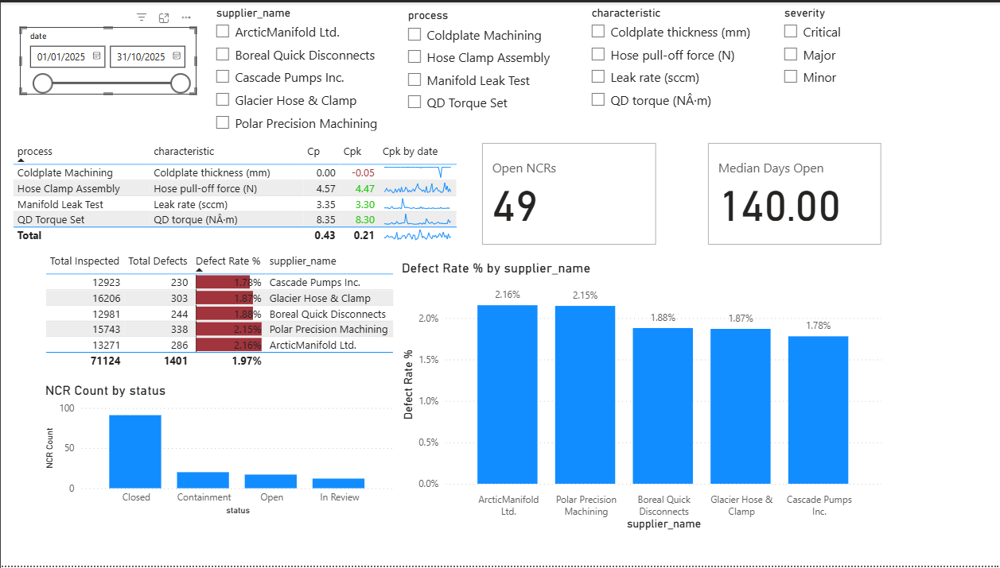

## Supplier Quality & Capability Dashboard (Power BI)

A one-page, operations-ready view of **incoming supplier quality**, **in-process capability**, and **NCR backlog health** designed to drive weekly 8D actions and supplier containment.



### What this page answers

1. **Which suppliers drive incoming defects?**
   Ranked defect rate (% of inspected qty) with detail table for volume vs defects.
2. **Which processes/characteristics are capable?**
   **Cp/Cpk** by process & characteristic with a **monthly sparkline** to show drift.
3. **Are we closing the loop on issues?**
   **Open NCRs**, **Median Days Open**, and (optional) **Aging Bucket histogram** to expose stale items.

### How to read it (60-second guide)

* **Left:** If the first two suppliers sit >2%, open a Pareto to find one defect type to kill first; set incoming containment until <1.5%.
* **Center:** Green = capable (Cpk ≥1.33). Red/amber = hold lots and fix. The sparkline tells you if it’s a one-off or a trend.
* **Right:** If median days open >60, schedule a weekly triage and enforce 8D closure dates; escalate anything in **60d+**.

### Metrics (DAX summary)

```DAX
-- Incoming quality
[Total Inspected] = SUM ( incoming_inspections[inspected_qty] )
[Total Defects]   = SUM ( incoming_inspections[defect_qty] )
[Defect Rate %]   = DIVIDE ( [Total Defects], [Total Inspected], 0 )

-- Process capability (context = process/characteristic/date selection)
[Mean]   = AVERAGE ( inprocess_measurements[measurement] )
[StdDev] = STDEV.S ( inprocess_measurements[measurement] )
[USL]    = MAX ( inprocess_measurements[USL] )
[LSL]    = MAX ( inprocess_measurements[LSL] )
[Cp]     = DIVIDE ( [USL] - [LSL], 6 * [StdDev] )
[Cpu]    = DIVIDE ( [USL] - [Mean], 3 * [StdDev] )
[Cpl]    = DIVIDE ( [Mean] - [LSL], 3 * [StdDev] )
[Cpk]    = MIN ( [Cpu], [Cpl] )

-- NCR health
[Open NCRs] =
    CALCULATE ( DISTINCTCOUNT ( ncr_log[ncr_id] ), ncr_log[status] <> "Closed" )

[Median Days Open] =
    MEDIANX ( FILTER ( ncr_log, ncr_log[status] <> "Closed" ), ncr_log[Days Open] )

[NCR Count] = DISTINCTCOUNT ( ncr_log[ncr_id] )
```

*(Optional columns for the histogram are in the “Aging Bucket” snippet above.)*

### Data model

* **suppliers** → 1:* → **incoming_inspections** (by `supplier_name`)
* **suppliers** → 1:* → **ncr_log** (by `supplier_name`)
* **inprocess_measurements** stands alone (sliced by date/process/characteristic).
  Data here is **synthetic** and sized for quick interaction.

### Suggested slicers

* Date (relative or between), Supplier, Process, Characteristic, Severity.

<!-- ### Presenting tips

* Keep the “why it matters” in every sentence (containment, capability gate, 8D burn-down).
* When Cpk is negative/near-zero: call out **off-center process** and request **MSA + setup review**.
* End with a goal & cadence: “Weekly 15-min review, target <1.5% incoming, Cpk ≥1.33, median <45 days.” -->